# 🔍 키워드 검색(BM25) vs 벡터 검색(임베딩) vs 하이브리드 검색

> 어떤 상황에서 어떤 검색이 유리한가?  
> **Keyword → Vector → Fusion(RRF) → Semantic Re-ranking** 파이프라인을 기준으로, 각 단계의 원리·강점·한계를 기술 전문가 관점에서 정리합니다.

---

## 🗺️ 전체 하이브리드 검색 파이프라인

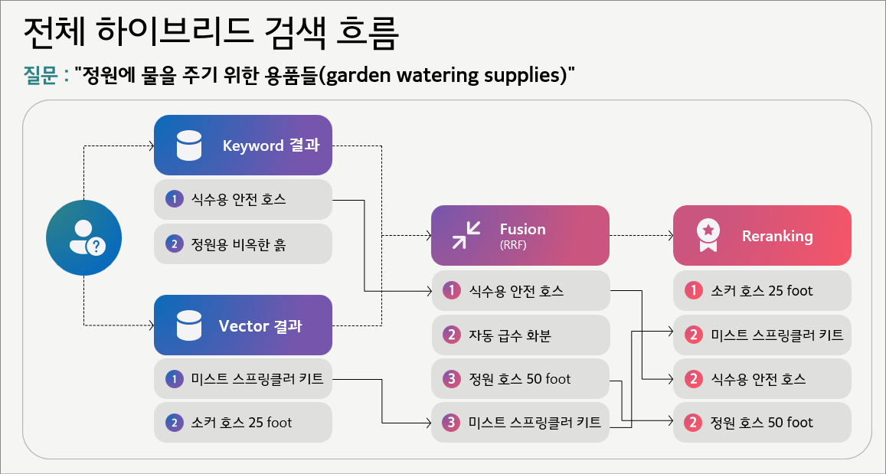

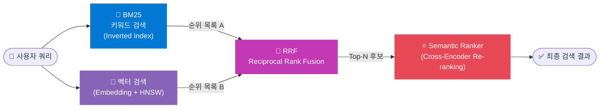

| 단계 | 역할 | 핵심 기술 |
|---|---|---|
| ① **키워드 검색(BM25)** | 정확한 토큰 매칭으로 후보 수집 | BM25 |
| ② **벡터 검색(임베딩)** | 의미 유사도 기반 후보 수집 | Embedding + HNSW(ANN) |
| ③ **RRF Fusion** | 두 결과 리스트를 상대 순위로 결합 | Reciprocal Rank Fusion |
| ④ **Semantic Re-ranking** | Top-N 후보를 쿼리·문서 쌍 단위로 재평가 | Cross-Encoder (human-labeled 데이터로 학습) |

---

## 📊 한눈에 보는 선택 가이드

| 쿼리/상황 | 🔵 키워드(BM25) | 🟣 벡터(임베딩) | 🔀 하이브리드(RRF) | ⭐ Re-ranking |
|---|---|---|---|---|
| 정확한 키워드/모델명/코드/숫자 조건 | ✅ 1순위 | △ 보조 | ✅ 안정화 | △ 필요 시 |
| 자연어 문장형 / 의도 중심 / 다양한 표현 | △ 보조 | ✅ 1순위 | ✅ 안정화 | △ 필요 시 |
| 정확성 + 의미 동시 요구 (프로덕션 기본) | △ 보조 | △ 보조 | ✅ **1순위** | △/✅ 품질 목표에 따라 |
| 최종 Top-N 정렬 품질이 핵심인 서비스 | △ | △ | ✅ 필수 | ✅ **1순위** |
| Knowledge source 자체가 모호/불명확 | ⚠️ 효과 제한 | ⚠️ 효과 제한 | ⚠️ 근본 해결 아님 | ⚠️ 후보가 없으면 무의미 |

> 📌 **표기**: ✅ 권장 · △ 상황에 따라 · ⚠️ Knowledge source 품질 개선 선행 필요

---

## 1️⃣ 키워드 검색 (BM25)

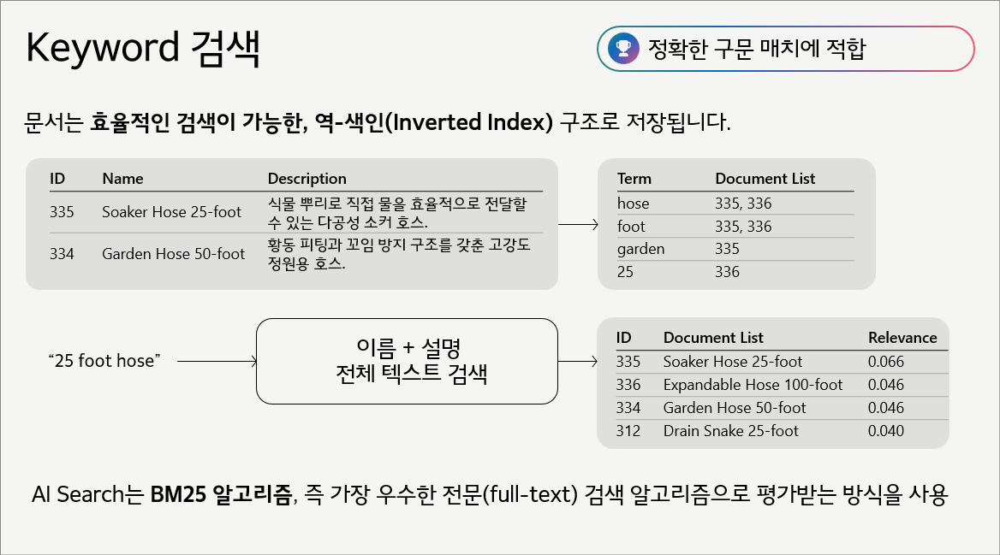

### 💡 핵심 원리

- 문서를 **역색인(Inverted Index)** 구조로 저장한다. 각 토큰(term)이 어떤 문서에 등장하는지 미리 매핑해 둔 구조다.
- **BM25(Best Match 25)** 는 TF(Term Frequency)·IDF(Inverse Document Frequency)·문서 길이 정규화를 결합한 업계 표준 풀텍스트 랭킹 알고리즘이다.
- 쿼리 토큰이 문서에 **실제로 존재**하고, **문서 길이 대비 자주 등장**할수록 BM25 점수가 높아진다.
- Azure AI Search는 이 BM25를 풀텍스트 랭킹의 기본으로 사용한다.

> 🔎 **장점**: 어떤 토큰이 매칭됐는지 명확하므로 결과의 설명 가능성(explainability)이 높다.

### ✅ 강점 — 정확 토큰 매칭

| 상황 | 예시 |
|---|---|
| 쿼리에 정확한 용어가 명시된 경우 | `25 foot hose` → "25", "foot", "hose" 각 토큰이 역색인에서 직접 조회됨 |
| 숫자/단위/제품명/오류코드 등 고유 토큰 | `iPhone 15 Pro`, `ABC-1234`, `ERROR-0x80070057` |
| 특정 용어 반복이 강한 관련성 신호인 경우 | 문서 내 "hose" 다회 등장 → TF 가중치로 BM25 점수 상승 |

### ⚠️ 한계 — 의미/의도 이해 불가

**쿼리**: `"낭비 없이 식물에 효율적으로 물을 주는 방법"`

- **근본 문제**: 사용자의 의도(목표)가 특정 키워드로 고정되어 있지 않다.
- 역색인은 **단어 빈도만** 볼 뿐, 의도·문맥·동의어 관계를 이해하지 못한다.
- 결과적으로 "수성 폴리우레탄", "수성 목재 스테인" 같이 `수(水)`와 우연히 겹치는 무관 문서가 상위로 올라오는 false positive가 발생할 수 있다.

---

## 2️⃣ 벡터 검색 (임베딩)

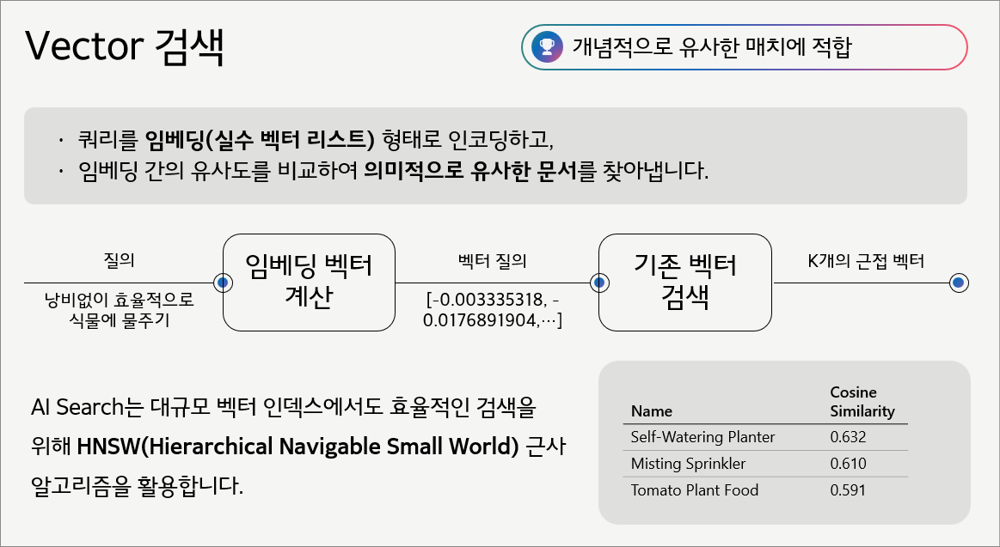

### 💡 핵심 원리

- 텍스트를 Embedding 모델(예: Azure OpenAI `text-embedding-3-*`)로 **고차원 수치 벡터**로 변환한다.
- 인덱스에 저장된 문서 벡터와 쿼리 벡터 간의 **코사인 유사도(Cosine Similarity)** 또는 내적(Dot Product)으로 근접 문서를 탐색한다.
- 표현(단어)이 달라도 **의미적으로 유사**하면 벡터 공간에서 가까운 거리에 위치하므로 상위에 오른다.

### ⚡ 대규모 인덱스: HNSW (ANN)

벡터 검색을 수백만~수십억 건 규모에서 빠르게 처리하기 위해, Azure AI Search는 **HNSW(Hierarchical Navigable Small World)** 기반의 ANN(Approximate Nearest Neighbor) 알고리즘을 사용한다.

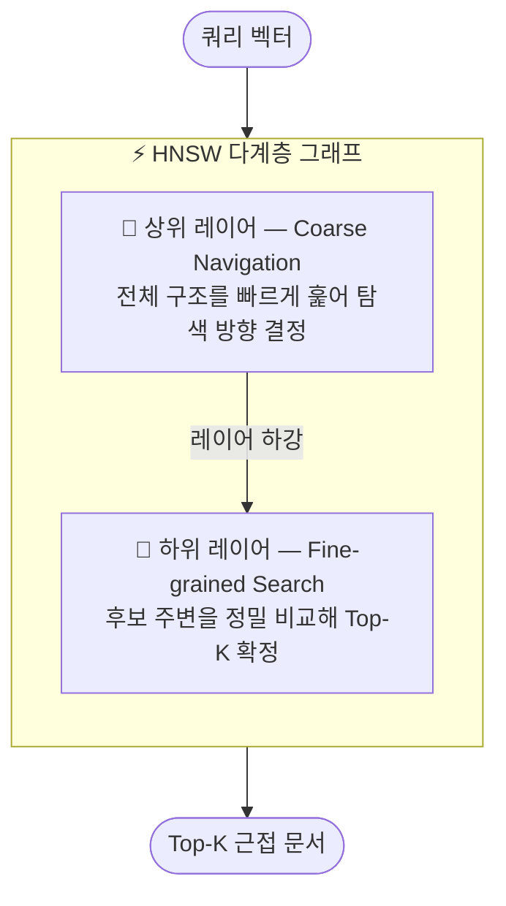

| 탐색 방식 | 정확도 | 시간 복잡도 | 대규모 적합성 |
|---|---|---|---|
| **KNN** (Exact Search) | ✅ 100% 정확 | 🐌 느림 | ❌ 대규모 부적합 |
| **HNSW / ANN** (Approximate) | ✅ 90-99% | ⚡ 빠름 | ✅ 수십억 건 확장 가능 |

### ✅ 강점 — 의미/의도 기반 검색

| 상황 | 예시 |
|---|---|
| 자연어 문장형/설명형 쿼리 | "낭비 없이 식물에 효율적으로 물 주기" → Soaker Hose, 셀프워터링 화분 등 상위 |
| 표현이 다른 문서와 매칭 | 쿼리: "식물 물주기" / 문서: "관개(irrigation, 물을 끌어들임)" → 의미 매칭 |
| 목표(행동) 중심 검색 | "효율적으로", "낭비 없이"처럼 의도가 담긴 표현 → 유사 의도 문서 검색 |

### ⚠️ 한계 — 정확한 숫자/고유값 구분

**쿼리**: `"안 부러지는 100피트 호스"`

- Embedding 모델은 "50피트" / "75피트" / "100피트"를 의미적으로 크게 구분하지 못하는 경향이 있다.
- 결과적으로 "호스" 카테고리는 잡지만, **정확한 수치 조건을 1순위로 반영하지 못해** 랭킹이 어긋날 수 있다.
- Embedding은 "평균 의미 벡터"를 표현하기 때문에, 희귀 수치 구분에는 BM25의 exact match가 더 유리하다.

---

## 3️⃣ RRF — 키워드 + 벡터 결과 융합

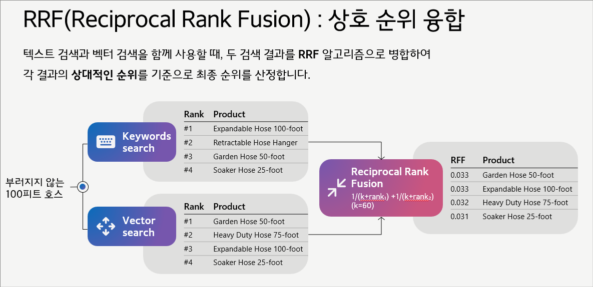

### 💡 왜 필요한가?

- BM25는 **exact token match**에 강하고, 벡터는 **semantic similarity**에 강하다.
- 둘 중 하나만 쓰면 반드시 놓치는 케이스가 발생한다.
- 두 결과 리스트를 **상대 순위 기반**으로 공정하게 결합해 recall을 안정화한다.

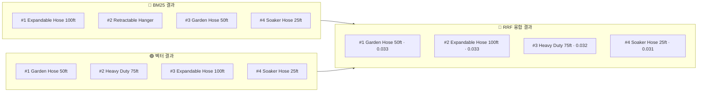

### 🧮 RRF 알고리즘 — 상대 순위 기반 결합

두 검색 방식의 점수 단위가 달라(BM25 점수 vs 코사인 유사도) **절대 점수를 그대로 합산하기 어렵기** 때문에, 각 리스트에서의 **순위(rank)** 를 사용해 결합한다.

$$
\text{RRF\_score}(d) = \sum_{i} \frac{1}{k + \text{rank}_i(d)}
$$

- $d$: 문서 / $\text{rank}_i(d)$: $i$번째 검색 결과 리스트에서 문서 $d$의 순위
- $k$: 상위 손림(순위=1 독점)을 완화하는 상수 (Azure AI Search 기본값: **60**)
- 여러 리스트에서 **모두 상위권**에 있는 문서일수록 RRF 점수가 높아진다.

| 쿼리: "안 부러지는 100피트 호스" | 🔵 BM25 단독 | 🟣 벡터 단독 | 🔀 하이브리드(RRF) |
|---|---|---|---|
| 의미 커버 | △ | ✅ | ✅ |
| 정확 수치(100ft) 반영 | ✅ | ⚠️ 약함 | ✅ 보완됨 |
| 전반적 안정성 | △ 편향 가능 | △ 편향 가능 | ✅ 안정화 |

---

## 4️⃣ Semantic Re-ranking — 최종 순위 정밀 보정

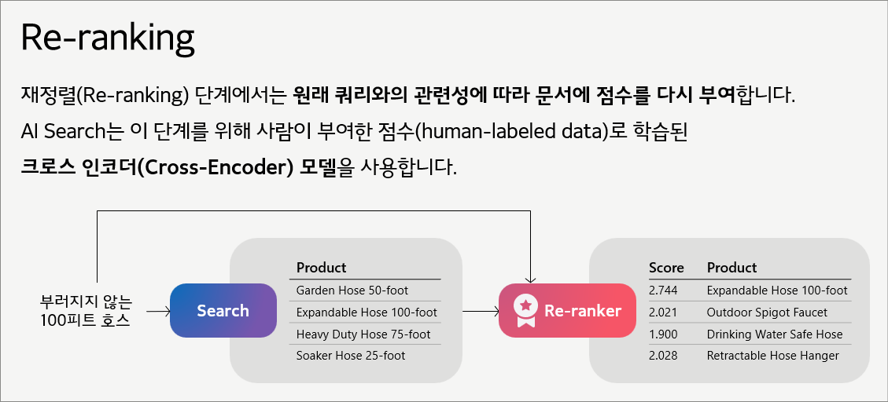

### 💡 핵심 원리

- RRF로 "합리적인 후보군(Top-N)"을 구성한 다음, **쿼리·문서 쌍(pair) 단위**로 관련성을 다시 점수화해 재정렬한다.
- Semantic Ranker는 **LLM이 아니라 Cross-Encoder** 계열 모델이다. Embedding 모델(Bi-Encoder)과 구조적으로 다르다.

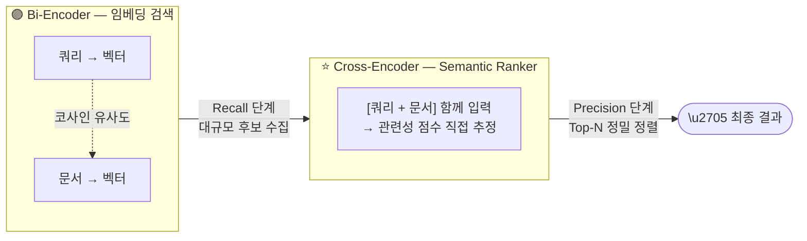

| 구분 | 🟣 Bi-Encoder (임베딩) | ⭐ Cross-Encoder (Semantic Ranker) |
|---|---|---|
| 처리 방식 | 쿼리·문서를 **각각** 벡터화 후 유사도 비교 | 쿼리+문서를 **함께** 입력해 관련성 직접 추정 |
| 적합 단계 | Candidate Generation (대규모 Recall) | Re-ranking (Top-N Precision 향상) |
| 학습 데이터 | 일반 언어 코퍼스 | **사람이 레이블링한** 쿼리-문서 관련성 점수 |
| 비용/지연 | 🟢 낮음 (사전 인덱싱 가능) | 🟡 추가 비용·지연 (쿼리 시점 실시간 계산) |

### 🎯 절대 점수(Absolute Score) 기반 컷

- Semantic Ranker는 재정렬 순위 외에 **관련성 절대 점수**를 함께 반환할 수 있다.
- 일정 임계값(threshold) 이하 결과를 응답에서 **아예 제외**하는 운영이 가능해, 저품질 결과를 사용자에게 노출하지 않을 수 있다.

---

## 🚀 실무 권장: 단계별 품질 향상 전략

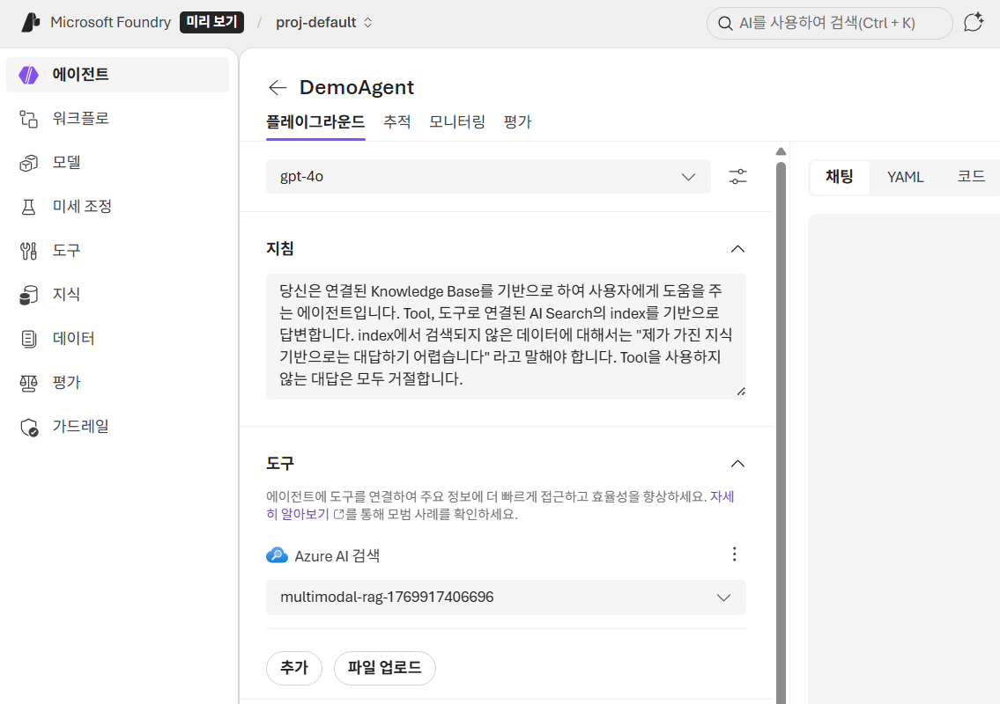

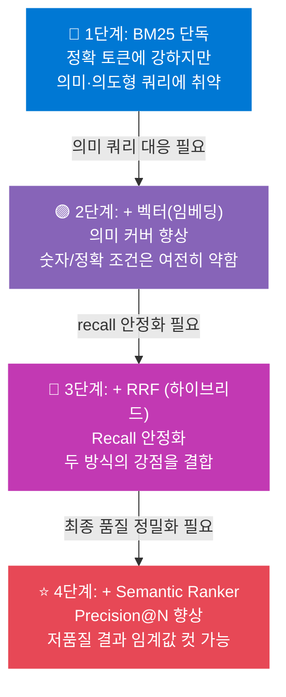

| 단계 | Recall | Precision@N | 비용/복잡도 |
|---|---|---|---|
| BM25 단독 | 🟡 중간 | 🟡 중간 | 🟢 낙음 |
| + 벡터(임베딩) | 🟢 향상 | 🟡 중간 | 🟡 중간 |
| + RRF (하이브리드) | ✅ 높음 | 🟢 향상 | 🟡 중간 |
| + Semantic Ranker | ✅ 높음 | ✅ 높음 | 🔴 추가 비용 |

---

## ⚠️ 검색 품질의 전제: Knowledge Source(콘텐츠) 품질

모든 검색 파이프라인은 결국 아래 두 단계의 조합이다.

- **Candidate Generation (Recall)**: 질문에 관련 있는 문서를 Top-K 안으로 끔어올린다.
- **Ranking / Re-ranking (Precision@K)**: Top-K 안에서 더 정답에 가까운 순서로 정렬한다.

따라서 **knowledge source 자체가 모호하거나 구조가 나제라면, 정답이 Top-K에 들어오지 않아** 어떤 랭킹/리랭킹 기법도 효과가 원천적으로 제한된다.

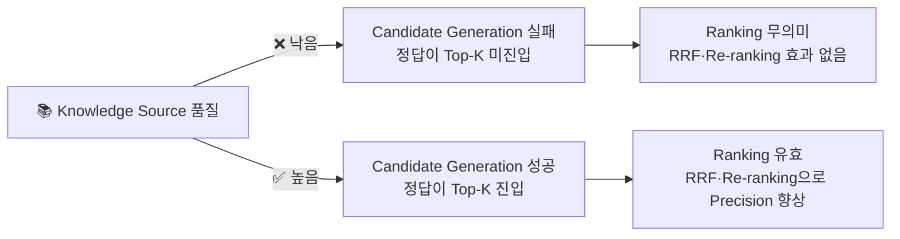

### 🔍 품질 저하의 대표 원인

| 원인 유형 | 구체적 증상 |
|---|---|
| 📄 **콘텐츠 불완전** | 업데이트 누락, 불완전한 문서, 질문에 직접 답하지 않는 구성 |
| 📝 **용어 비일관성** | 동일 개념의 약어·동의어·버전명 표기가 문서마다 제각각 |
| ✂️ **청킹 부적절** | 한 chunk에 여러 주제 혼합 → 핵심 임베딩 희석, 문맥 단절 |
| 🏷️ **메타데이터 부족** | 조건/버전/카테고리 정보가 본문에만 있어 filter 불가 |
| 🗑️ **노이즈 문서** | 중복/초안/폐기 문서가 인덱스에 섞여 후보군 오염 |

### 🛠️ 개선 우선순위 (알고리즘 튜닝보다 먼저)

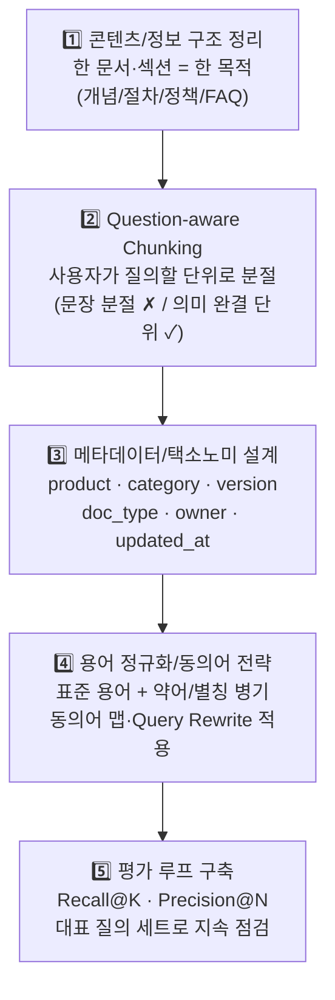

> 🎯 **요약**: 검색 품질의 상한선은 알고리즘이 아니라  
> **콘텐츠 품질 + 청킹 설계 + 메타데이터**가 결정하는 경우가 대부분이다.

---

## 🔧 Azure AI Search 적용 포인트

| 기능 | 적용 방법 | 비고 |
|---|---|---|
| 📄 **풀텍스트(BM25)** | `search` 파라미터에 쿼리 텍스트 전달 | 기본 활성화 |
| 🧠 **벡터 검색** | `vectorQueries`에 임베딩 벡터 전달 | 인덱스에 vector 필드 필요 |
| 🔀 **하이브리드(RRF)** | `search` + `vectorQueries` 동시 전달 | RRF 자동 적용 |
| ⭐ **Semantic Ranker** | `queryType: semantic` + `semanticConfiguration` 지정 | 별도 Semantic 설정 필요 |
| 🏷️ **메타 필터 + 검색** | `filter` + `search`/`vectorQueries` 조합 | 재현성 높은 운영 패턴 |

> 🏆 **권장 운영 패턴**:  
> `filter(메타) → Hybrid(BM25 + Vector, RRF) → Semantic Re-ranking`  
> → RRF로 **Recall을 확보**하고, Semantic Ranker로 **Precision을 끌어올리는** 순서가 가장 안정적이다.
